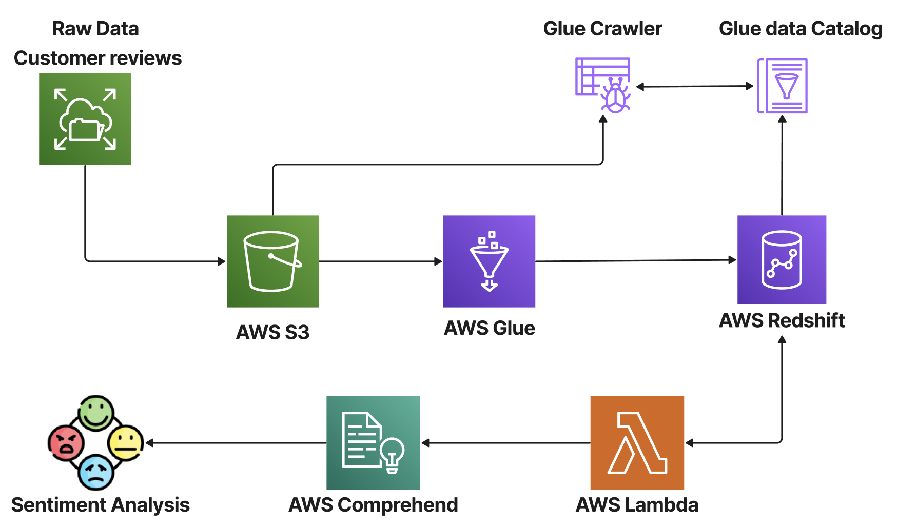

### This project repository has been developed as part of the requirements for the Big Data Analytics course within the Master of Science in Business Analytics program at the Carlson School of Management, University of Minnesota.

### Introduction to ETL and AWS Glue
Automation plays a pivotal role in constructing end-to-end machine learning products, and at the forefront of this process is data preparation through Extract, Transform, Load (ETL) pipelines. ETL is fundamental for Data Analytics and Machine Learning workflows, as it cleanses and organizes data, meeting specific business intelligence requirements and enhancing overall operations.

### AWS Glue, a serverless data integration service, simplifies the discovery, preparation, movement, and integration of data from diverse sources for analytics, machine learning, and application development. With the ability to connect to over 70 data sources, manage data in a centralized catalog, and create, run, and monitor ETL pipelines, AWS Glue provides a powerful solution for loading data into data lakes. This project showcases the utilization of Amazon's customer reviews data in conjunction with AWS Redshift, demonstrating the capabilities of AWS Glue.

### Dataset Overview
Amazon Customer Reviews, also known as Product Reviews, is an iconic product of Amazon, with millions of customers contributing reviews since 1995. The dataset contains customer review text and associated metadata, encompassing reviews from the Amazon.com marketplace between 1995 and 2015. It serves as a valuable resource for studying customer opinions, evaluating experiences, and understanding product perceptions at scale.

### The dataset is available in two formats:

Tab-separated values (TSV) - Amazon Reviews TSV

Parquet - Amazon Reviews Parquet

This project employs a small sample from the parquet dataset to illustrate the ETL pipeline orchestration.

### Implementation Approach
Store a sample dataset of customer reviews in Amazon Simple Storage Service (Amazon S3).
Utilize an AWS Glue crawler to create an AWS data catalog.
Implement a Glue job to load data into Redshift.
Employ AWS Lambda functions and Amazon Comprehend to analyze sentiment and entities in the reviews.
For detailed replication steps, follow the instructions in the provided .md filenames.

### Tools and Technologies
Amazon S3

AWS Glue

Amazon Redshift

AWS VPC

AWS Lambda

Amazon Comprehend

AWS Architecture Overview

This project leverages the aforementioned tools and technologies to create an efficient ETL pipeline, showcasing the seamless integration of AWS Glue into the broader AWS ecosystem.
